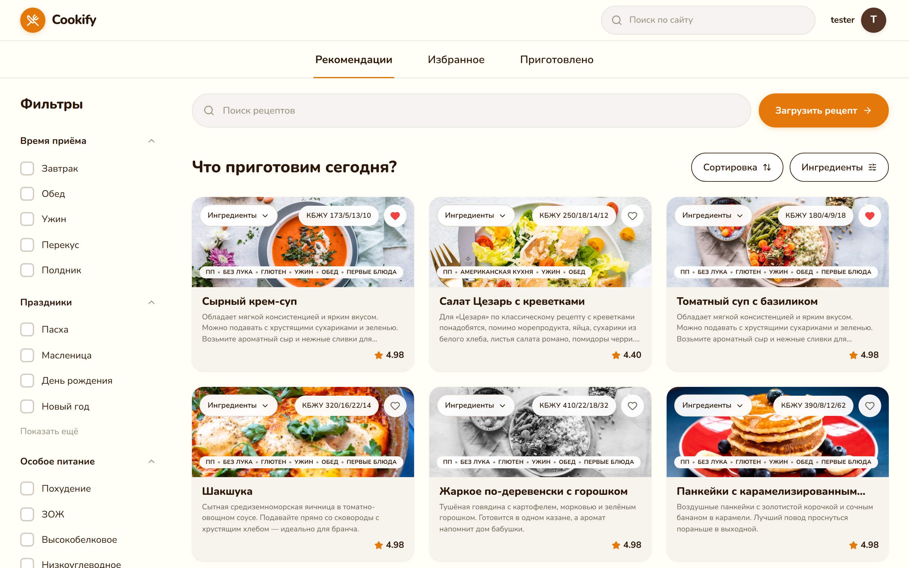
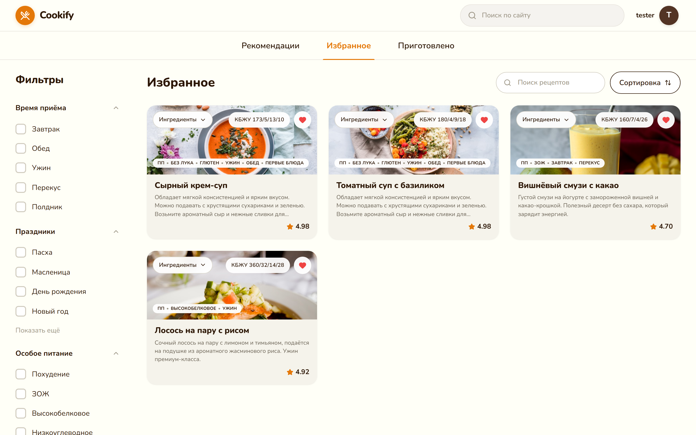
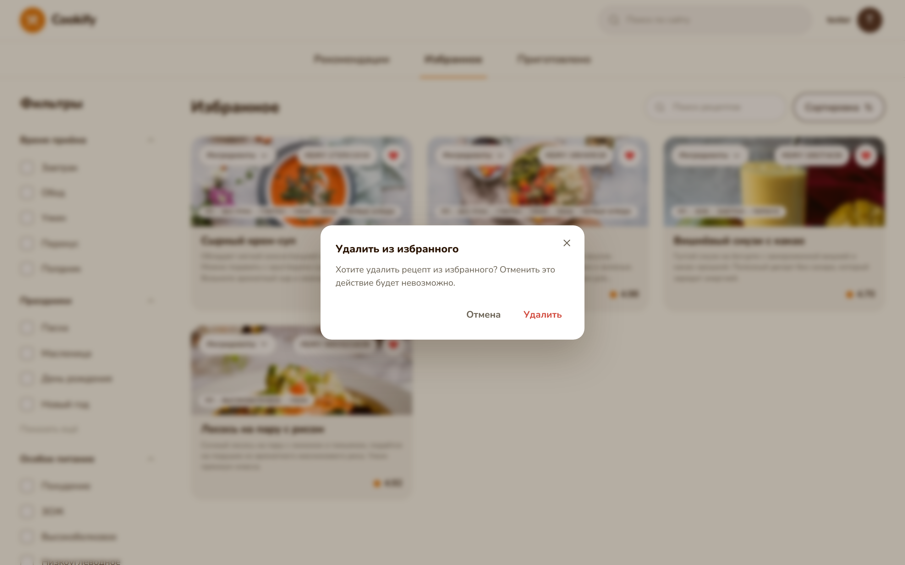
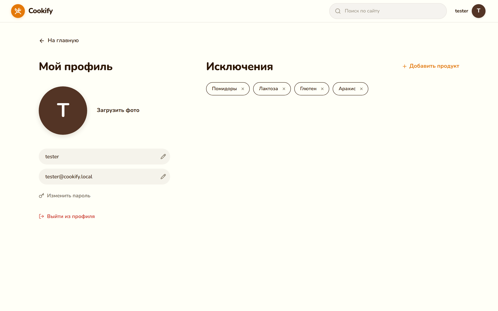
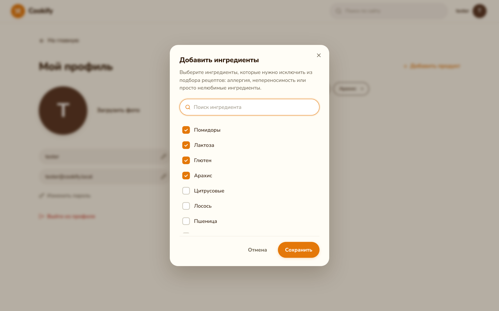

# Главная и профиль: обновление по Figma

- **Дата:** 2026-04-25
- **Автор:** Кирилл
- **Скоуп:** `src/components/Cookify.tsx`, `src/components/profile/ExclusionsSection.tsx`, `src/pages/ProfilePage.tsx`, `src/components/hooks/useFavorites.ts`, `src/components/hooks/useExclusions.ts`, `src/components/contexts/AuthContext.tsx`, `src/styles/cookify.css`, `src/styles/profile.css`
- **Связанные коммиты:** на момент отчёта изменения находятся в рабочей копии (ещё не закоммичены)
- **Ссылка на дизайн:** [Figma — Веб-платформа для кулинарных рецептов](https://www.figma.com/design/JXZblTM4YMOmy5jgQHfW3E/Веб-платформа-для-кулинарных-рецептов)

## 1. Цель

Привести главную и профиль к свежему макету: ужать карточки, добавить ассортимент рецептов (9 новых блюд), сделать «Избранное» рабочим (с подтверждением удаления), и закрыть раздел профиля «Исключения» вместе с модалкой выбора ингредиентов. Всё — с сохранением a11y, адаптива и без регрессий по сборке.

## 2. Что сделано

- **Карточки и пилюли на главной.**
  - Бордер пилюль «Сортировка» / «Ингредиенты» сделан жёстче: цвет границы переключён с `var(--ck-line)` на `var(--ck-ink)` — `src/styles/cookify.css`.
  - Медиа карточки теперь `aspect-ratio: 380 / 154`, тело уплотнено (типографика ↓, padding/gap ↓), общий размер карточки ≈ 380×264 при ширине 380px. Грид перешёл на `repeat(N, minmax(0, 1fr))`, чтобы текст в `__desc` корректно ужимался по `clamp 3 lines`. Файл — `src/styles/cookify.css`.
  - На `` карточки добавлены `width={380}` и `height={154}`, чтобы исключить CLS — `src/components/Cookify.tsx:455`.
- **+9 рецептов на главной.** Добавлены id 7–15: Вишнёвый смузи с какао, Финский черничный пирог, Тост с авокадо и яйцом, Гречотто с грибами, Лосось на пару с рисом, Боул с киноа и нутом, Тыквенный крем-суп с имбирём, Сырники с малиной, Курица терияки с овощами. У всех — реалистичные КБЖУ, рейтинги, теги и список ингредиентов. Источник — массив `RECIPES` в `src/components/Cookify.tsx`.
- **Избранное.** Состояние вынесено в новый хук `src/components/hooks/useFavorites.ts`: `Set<string>`, persist в `localStorage` ключом `cookify:favorites`, кросс-вкладочная синхронизация через `storage` event. CookifyApp теперь читает `favorites` из хука, а вкладка «Избранное» фильтрует список по членству в `Set`.
- **Подтверждение удаления из избранного.** В `Cookify.tsx` добавлен `pendingUnfav` + новый `ConfirmModal` (portal, `role="alertdialog"`, `aria-modal`, autoFocus на «Отмена», Esc-close, body overflow lock). Сценарий: «лайкнуть» — добавляет сразу; «снять лайк» — открывает модалку «Удалить из избранного» с парой `Отмена / Удалить`. Стили — `.ck-confirm*` в `src/styles/cookify.css`.
- **Профиль: 2-колоночная сетка + back-link.** В `src/pages/ProfilePage.tsx` верстка переведена на `.profile-grid` (на ≥1024px — `minmax(0, 420px) minmax(0, 1fr)`). Слева — заголовок, аватар, поля, «Изменить пароль», «Выйти из профиля» (текстовая красная кнопка). Сверху — Back-link `«← На главную»`. Справа — секция «Исключения».
- **Секция «Исключения» + модалка ингредиентов.** Новый компонент `src/components/profile/ExclusionsSection.tsx` (два `memo`: секция и модалка):
  - chips с крестиком (1.5px бордер) и empty-state;
  - кнопка `+ Добавить продукт` открывает модалку;
  - модалка — portal в `document.body`, `role="dialog"`, `aria-labelledby/describedby`, autoFocus на инпут поиска, Esc и клик по бэкдропу закрывают, чекбоксы с кастомным оранжевым box + SVG-галочкой;
  - на «Сохранить» считается дельта `toAdd / toRemove` и применяется через `onAdd / onRemove`.
  - Состояние — отдельный хук `src/components/hooks/useExclusions.ts`, ключ `cookify:exclusions:${userId}` (или глобально без user'а), пере-чтение при смене userId, `storage`-синхронизация.
- **Лечение pre-existing eslint-нарушений на пути изменений.**
  - В `Cookify.tsx` шаблон `const { [groupId]: _, ...rest } = prev` (с `_`) был заменён на `const rest = { ...prev }; delete rest[groupId]` (правило `no-unused-vars`).
  - В `ProfilePage.tsx` `commitEdit` был объявлен через `useCallback` после раннего `return null` — это «hook-after-conditional». Конвертировано в обычную функцию (мемоизация здесь не нужна, родитель не `memo`).
  - В `AuthContext.tsx` `useState(null) + useEffect(setUser(getCurrentUser))` заменён на ленивый инициализатор `useState(() => mockAuth.getCurrentUser())` — снимает ругань `react-hooks/set-state-in-effect`. `isReady` стал константой, потому что localStorage-чтение синхронно.
  - В `ProfilePage.tsx` дополнительно добавлен пропавший импорт `'@/styles/profile.css'` — без него профиль рендерился без стилей (поймано во время первого Playwright-прогона).

## 3. Скриншоты

Сделано через `docs/reports/capture.mjs` (Playwright, Chromium, viewport 1440×900, deviceScaleFactor 2). Скрипт сидит в репозиторий и переиспользуется для будущих отчётов.

## 4. Решения и trade-offs

- **localStorage вместо backend.** Избранное и исключения — это user-data. По уму это `PATCH /me/preferences`, но бэка пока нет, поэтому persist в `localStorage` + cross-tab sync. Хуки `useFavorites` / `useExclusions` сделаны так, что переезд на сеть = поменять источник истины, не API.
- **Ключ исключений с `userId`.** `cookify:exclusions:${userId}` — иначе два аккаунта на одном устройстве делили бы список. Для anonymous (нет user) — глобальный ключ как fallback.
- **Подтверждение только на удаление.** Добавление в избранное ничего не «теряет», а удаление — потенциально болезненный клик. Поэтому диалог только на путь `Set → Set\{id}`. Это и user-friendly, и совпадает с паттерном «destructive action confirm».
- **Модалки через `createPortal`.** Чтобы вырваться из `overflow:hidden` родителей и из любых z-index конфликтов. На бэкдроп — `onClick={onClose}`, на `dialog` — `onClick={stopPropagation}`. Стандартный приём.
- **Aspect-ratio вместо фиксированных размеров на ``.** В Figma карточка строго 380×154, но grid на десктопе — `repeat(auto-fill, minmax(...))`. Зафиксированный ratio даёт корректную геометрию на любой ширине; явные `width/height` атрибуты на `` нужны для CLS, не для лейаута.
- **Не рефакторил `Cookify.tsx` целиком.** Файл уже довольно толстый, но задача стояла не «вынести RecipeCard в свой файл», а «сделать фичи». Декомпозиция — отдельный отчёт, когда дойдут руки.
- **Один `index.md` как формат, а не как индекс.** Спорный нейминг: классически `index.md` — это перечень. Здесь это спецификация формата (как просил пользователь). Список будущих отчётов в этом файле появится сам — каждый отчёт самодостаточен и кросс-линкуется датой.

## 5. Качество

- [x] `npm run lint` — **0 ошибок**, 3 warning'а (все pre-existing, не от текущих правок: `react-refresh/only-export-components` в `AuthContext.tsx`; два `Unused eslint-disable directive` в `mockAuth.ts`).
- [x] `npm run build` — **успех за 3.21s**. Бандл: `index.css 47.79 KB (gzip 9.08 KB)`, `index.js 249.60 KB (gzip 76.66 KB)`, `vendor.js 49.57 KB (gzip 17.35 KB)`.
- [x] **WCAG 2.2 AA**: у всех интерактивных элементов есть `aria-label` / `aria-labelledby`; модалки помечены `role="dialog"` / `role="alertdialog"` + `aria-modal`; tab order работает (autofocus на поиск/Cancel), Esc закрывает, фокус не утекает за бэкдроп; контрасты текста — фон `#fff`/`#FAEBD2`, текст `#2C1605` и `#D14A3D` (для destructive).
- [x] **Адаптив**. Главный grid — `repeat(auto-fill, minmax(280px, 1fr))`. Профиль: 1 колонка на мобильном, 2 — на ≥1024px. Модалки — `width: min(92vw, 480px)`, безопасный padding на маленьких экранах.
- [ ] **Lighthouse** — не прогонял в этой итерации (нет CI-настроек). Стоит включить в pipeline как отдельную задачу.

## 6. Что осталось

- Прогнать Lighthouse и приложить цифры (Performance / A11y / SEO / BP).
- Декомпозировать `Cookify.tsx`: вынести `RecipeCard`, `FilterSidebar`, `ConfirmModal` в свои файлы — это разгрузит главный файл и даст React.memo границу на нужных уровнях.
- Когда появится backend — заменить `useFavorites` / `useExclusions` на сетевые версии с теми же сигнатурами, не трогая компоненты.
- Унифицировать модалку: сейчас confirm и exclusions модалки независимо реализуют backdrop+portal+esc. Стоит вынести в общий `<Modal>` (но только если будет ≥3 случая использования — иначе преждевременная абстракция).
